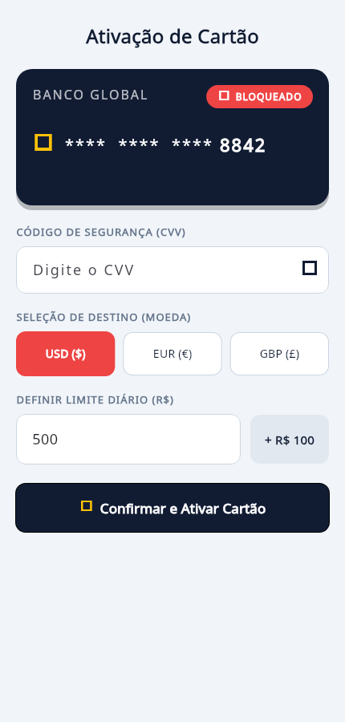
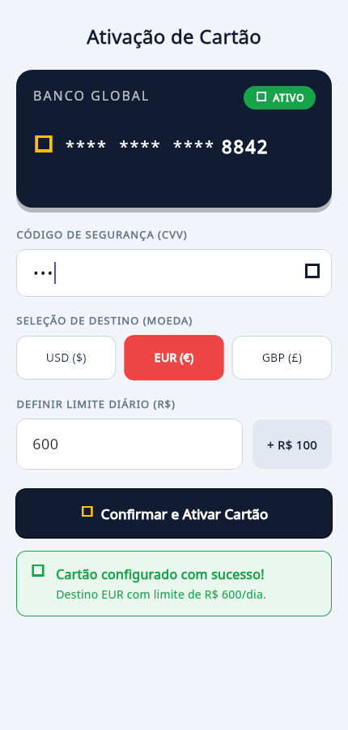
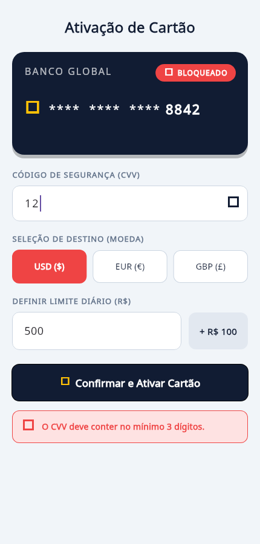

# AV1 – Avaliação Prática | Ativação de Cartão Internacional

**Curso:** Análise e Desenvolvimento de Sistemas
**Unidade Curricular:** Desenvolvimento de Sistemas Móveis
**Tecnologia:** Flutter (apenas `package:flutter/material.dart`, sem dependências externas)

Tela de **Ativação e Ajuste de Limite de Segurança** do Cartão Internacional:
o cliente ativa o cartão, escolhe a moeda de destino e ajusta o limite diário.

## Telas

| Estado inicial | Após ativação | Validação com erro |
|---|---|---|
|  |  |  |

## Como executar

```bash
flutter pub get
flutter create .          # gera as pastas de plataforma (android/ios/web/...)
flutter run
```

O código da solução está em **`lib/main.dart`** (arquivo único).

## Testes

```bash
flutter test
```

9 testes de widget cobrem a alternância do CVV, o incremento do limite,
a troca de moeda, as duas regras de validação e a exibição do painel de sucesso.

## Atendimento aos critérios de avaliação

| Critério | Onde foi implementado |
|---|---|
| Proteção da interface contra recortes físicos do dispositivo | `SafeArea` envolvendo todo o corpo do `Scaffold` |
| Prevenção de overflow do teclado | `SingleChildScrollView` + `FittedBox` na linha do número do cartão |
| Estrutura visual do cartão de destaque | `_construirCartao()` – `Container` escuro, cantos arredondados e sombra |
| Sobreposição de elementos em profundidade | `Stack` dentro do cartão |
| Indicador de status fixado no canto do cartão | `Positioned(top: 0, right: 0)` com `_construirEtiquetaStatus()` |
| Opções de moeda alinhadas horizontalmente | `Row` em `_construirSeletorDeMoedas()` |
| Distribuição proporcional do espaço entre as moedas | `Expanded` em cada um dos três botões |
| Destaque visual da moeda selecionada | `_construirBotaoMoeda()` compara com `_moedaSelecionada` e troca cor, borda e peso da fonte |
| Rótulos e bordas do campo de código de segurança | `_construirRotulo()` + `OutlineInputBorder` em `_construirCampoCvv()` |
| Alternância da visibilidade dos dígitos do CVV | `obscureText: _cvvOculto` + `_alternarVisibilidadeCvv()` |
| Botão de ação rápida dentro do campo de texto | `suffixIcon: IconButton(...)` no campo do CVV |
| Campo de limite alinhado com o botão de acréscimo | `Row` com `Expanded` + botão em `_construirCampoLimite()` |
| Lógica de incremento do limite diário | `_incrementarLimite()` soma R$ 100 ao valor atual |
| Alteração de dados na memória | `StatefulWidget` com `TextEditingController` e variáveis de estado |
| Redesenho da interface ao alterar as variáveis | `setState()` em todas as ações do usuário |
| Destaque do botão principal | `ElevatedButton.icon` de largura total, fundo escuro e ícone de cadeado |
| Validação dos dados antes da confirmação | `_confirmarAtivacao()`: CVV com no mínimo 3 dígitos e limite mínimo de R$ 100 |
| Feedback visual de erro para dados inválidos | `_construirMensagemErro()` – painel vermelho exibido condicionalmente |
| Alteração do status do cartão após a confirmação | `_cartaoAtivo = true` muda a etiqueta de "BLOQUEADO" para "ATIVO" |
| Painel de sucesso condicional com o resumo | `if (_mostrarSucesso) _construirPainelSucesso()` – card verde com moeda e limite |

## Regras de validação

- **CVV** deve ter no mínimo **3 dígitos**.
- **Limite diário** não pode ser menor que **R$ 100**.

Se algum dos dois falhar, é exibida uma mensagem de alerta em vermelho e o
cartão permanece **BLOQUEADO**. Com os dados válidos, o cartão passa para
**ATIVO** e o card verde de confirmação apresenta o resumo da escolha.
